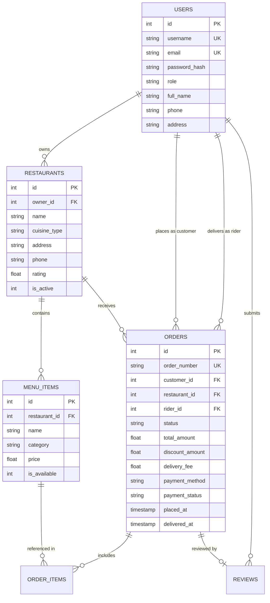

# FoodFlow - Food Delivery Application (Kanban MVP)

> **Course:** CSE 3206 – Software Engineering Sessional  
> **Institution:** Rajshahi University of Engineering & Technology (RUET)  
> **Department:** Computer Science & Engineering  
> **Lab Milestone:** Lab 2 – Software Process Models, Requirement Analysis & MVP Development  
> **Assigned Group:** Group 11  
> **Assigned Project:** Food Delivery Application  
> **Assigned Process Model:** **Kanban Process Model**

---

## Table of Contents

1. [Executive Summary & Project Overview](#1-executive-summary--project-overview)
2. [Software Process Model: Kanban Deep Dive](#2-software-process-model-kanban-deep-dive)
   - [What is Kanban?](#21-what-is-kanban)
   - [Core Practices of Kanban Applied in FoodFlow](#22-core-practices-of-kanban-applied-in-foodflow)
   - [Dual-Layer Kanban Architecture (Dev + Domain)](#23-dual-layer-kanban-architecture)
   - [Comparison Matrix: Kanban vs Alternative Process Models](#24-comparison-matrix-kanban-vs-alternative-process-models)
3. [Requirement Analysis](#3-requirement-analysis)
   - [Stakeholder Identification](#31-stakeholder-identification)
   - [Functional Requirements (FR)](#32-functional-requirements-fr)
   - [Non-Functional Requirements (NFR)](#33-non-functional-requirements-nfr)
   - [User Stories & Acceptance Criteria](#34-user-stories--acceptance-criteria)
4. [System Architecture & Design](#4-system-architecture--design)
   - [Layered MVC & Service Architecture](#41-layered-mvc--service-architecture)
   - [Database Schema (SQLite3)](#42-database-schema-sqlite3)
5. [Step-by-Step Installation & Execution Guide](#5-step-by-step-installation--execution-guide)
   - [Virtual Environment Setup (.venv)](#51-virtual-environment-setup-venv)
   - [Running the Application](#52-running-the-application)
   - [Default Demo Credentials](#53-default-demo-credentials)
6. [Automated Testing Suite (pytest)](#6-automated-testing-suite-pytest)
7. [PDF Documentation Generation](#7-pdf-documentation-generation)
8. [Project Directory Structure](#8-project-directory-structure)
9. [RESTful JSON API Documentation](#9-restful-json-api-documentation)

---

## 1. Executive Summary & Project Overview

**FoodFlow** is a modern, modular, multi-tenant food delivery application built using **Python** and **Flask**. It connects customers, restaurant kitchens, delivery couriers, and platform administrators through a frictionless web interface and a live **Kanban Flow Management System**.

### Problem Statement

Traditional food delivery operations in university environments face significant friction:

- **Kitchen Bottlenecks:** Orders flood kitchens during peak lunch/dinner hours without capacity regulation, leading to long wait times, food quality degradation, and stressed staff.
- **Opacity in Order Progression:** Customers lack granular real-time visibility into the exact stage of their meal preparation and dispatch.
- **Courier Misallocation:** Delivery riders lack clear pull mechanisms to claim ready orders as soon as packaging finishes.

### Solution

FoodFlow enforces **Kanban principles** at both the software engineering level (how the project is built) and the operational domain level (how food orders flow from kitchen to customer). By imposing explicit **Work-In-Progress (WIP) limits**, the system prevents kitchen overload, minimizes delivery lead time, and maximizes throughput.

---

## 2. Software Process Model: Kanban Deep Dive

### 2.1 What is Kanban?

**Kanban** (Japanese for _“signboard”_ or _“visual card”_) is an Agile framework rooted in Lean manufacturing (originating from Toyota's Just-In-Time production). Unlike iteration-based frameworks such as Scrum, Kanban is a **continuous flow pull system** designed to visualize work, limit multi-tasking and queue congestion, and continuously improve cycle times.

```
┌──────────────┐     ┌──────────────┐     ┌──────────────┐     ┌──────────────┐     ┌──────────────┐
│ Order Placed │ ──> │ Kitchen Prep │ ──> │ Ready/Pack   │ ──> │  In Transit  │ ──> │  Delivered   │
│  (Backlog)   │     │ (WIP Limit:5)│     │ (WIP Limit:4)│     │ (WIP Limit:6)│     │    (Done)    │
└──────────────┘     └──────────────┘     └──────────────┘     └──────────────┘     └──────────────┘
```

### 2.2 Core Practices of Kanban Applied in FoodFlow

1. **Visualize the Workflow:**
   - Both software engineering tasks and live customer orders are mapped visually across explicit columns.
   - Stakeholders can instantly identify where an order or feature resides and where delays are accumulating.
2. **Limit Work-In-Progress (WIP Limits):**
   - Imposes hard constraints on the number of items permitted in active states (e.g., maximum 5 concurrent meals in `Kitchen Preparing`).
   - If a column reaches capacity, new orders remain in the `Backlog` queue until capacity frees up, preventing quality degradation.
3. **Manage Flow:**
   - Continuous monitoring of **Lead Time** (time from order submission to customer delivery) and **Cycle Time** (active preparation and transit time).
   - Eliminates pauses, hand-off delays, and dead times between cooking and pickup.
4. **Make Process Policies Explicit:**
   - Clearly defined state transition rules (`ORDER_STATUS_FLOW`): An order cannot jump from `Placed` directly to `In Transit` without passing through `Preparing` and `Ready`.
5. **Implement Feedback Loops:**
   - Customers provide immediate ratings and reviews on completed orders, providing actionable feedback for kitchen quality.
6. **Improve Collaboratively & Evolve Experimentally:**
   - Configurable WIP limits allow managers to adjust capacity dynamically based on staffing and demand surges.

---

### 2.3 Dual-Layer Kanban Architecture

FoodFlow uniquely implements Kanban at **two concurrent levels**:

| Level                                       | Purpose                                                            | Columns                                                                                  | Key Metrics                                             |
| :------------------------------------------ | :----------------------------------------------------------------- | :--------------------------------------------------------------------------------------- | :------------------------------------------------------ |
| **Layer 1: Software Development Lifecycle** | Tracking Lab 2 software engineering features, bug fixes, and tests | `Backlog` → `In Progress (WIP: 3)` → `Review (WIP: 2)` → `Done`                          | Sprint lead time, velocity, code review turnaround      |
| **Layer 2: Real-Time Order Fulfillment**    | Live management of kitchen prep, packaging, and rider dispatch     | `Placed` → `Preparing (WIP: 5)` → `Ready (WIP: 4)` → `In Transit (WIP: 6)` → `Delivered` | Order Lead Time, Kitchen Cycle Time, Delivery Lead Time |

---

### 2.4 Comparison Matrix: Kanban vs Alternative Process Models

| Evaluation Criteria                    | Kanban (Selected)                                                | Agile Scrum                                                                                                                   | Waterfall                                                                                                           | Spiral Model                                                                                                  | Rapid App Dev (RAD)                                                                                    |
| :------------------------------------- | :--------------------------------------------------------------- | :---------------------------------------------------------------------------------------------------------------------------- | :------------------------------------------------------------------------------------------------------------------ | :------------------------------------------------------------------------------------------------------------ | :----------------------------------------------------------------------------------------------------- |
| **Delivery Cadence**                   | **Continuous Flow**                                              | Fixed 1-4 week Sprints                                                                                                        | Single Final Release                                                                                                | Iterative Prototypes                                                                                          | Rapid Timeboxed Prototypes                                                                             |
| **Work Organization**                  | **Pull System (WIP Limits)**                                     | Batch Sprint Backlog                                                                                                          | Strict Sequential Phases                                                                                            | Risk-Driven Cycles                                                                                            | Component Assemblies                                                                                   |
| **Change Flexibility**                 | **Instant (Real-time)**                                          | Next Sprint Planning                                                                                                          | Extremely Inflexible                                                                                                | High per cycle                                                                                                | High in early stages                                                                                   |
| **Suitability for Food Delivery**      | ⭐⭐⭐⭐⭐ **(100% Fit)**                                        | ⭐⭐⭐ (Timebox mismatch)                                                                                                     | ⭐ (Catastrophic rigidity)                                                                                          | ⭐⭐ (Excessive overhead)                                                                                     | ⭐⭐⭐ (Good for MVP only)                                                                             |
| **Why Alternatives are Less Suitable** | _Optimal match for 24/7 continuous on-demand order dispatching._ | Scrum's fixed sprint commitments cannot accommodate daily order spikes, emergency bug fixes, and continuous courier dispatch. | Waterfall requires complete upfront specification; late testing would discover critical UX/delivery flaws too late. | Spiral introduces immense risk-analysis overhead and high management costs unwarranted for consumer web apps. | RAD lacks structured continuous flow discipline required for production order fulfillment post-launch. |

---

## 3. Requirement Analysis

### 3.1 Stakeholder Identification

- **Customer:** Searches menus, places orders, applies coupons, tracks live delivery status, submits reviews.
- **Restaurant Owner:** Manages restaurant profile, performs full CRUD on menu items, updates kitchen preparation statuses.
- **Delivery Rider:** Claims ready orders, navigates to pickup and drop-off locations, marks deliveries completed, tracks earnings.
- **Platform Administrator:** Observes system-wide analytics (revenue, order counts, lead times, WIP saturation) and oversees users.

---

### 3.2 Functional Requirements (FR)

| ID       | Requirement Name            | Description                                                                                                   |
| :------- | :-------------------------- | :------------------------------------------------------------------------------------------------------------ |
| **FR1**  | User Authentication & RBAC  | Secure registration/login with password hashing and roles (`customer`, `restaurant_owner`, `rider`, `admin`). |
| **FR2**  | Restaurant Catalog & Search | Filter restaurants by cuisine (Italian, Japanese, Fast Food) and live text search.                            |
| **FR3**  | Menu Management (CRUD)      | Restaurant owners can add, edit, delete dishes, and toggle instant availability (In Stock / Sold Out).        |
| **FR4**  | Shopping Cart & Checkout    | Item quantity increment/decrement, coupon discounts (`RUET10`, `KANBAN5`), delivery address, and notes.       |
| **FR5**  | Order State Machine         | Enforced sequential state transitions (`placed` → `preparing` → `ready` → `in_transit` → `delivered`).        |
| **FR6**  | Rider Dispatch & Job Claim  | Riders view ready orders, accept delivery tasks, and complete drop-offs.                                      |
| **FR7**  | Payment Simulation          | Support Cash on Delivery (COD), simulated Credit Card, and simulated Digital Wallet (bKash/Nagad).            |
| **FR8**  | Customer Order History      | View past orders, itemized receipts, and live step-by-step progress timeline.                                 |
| **FR9**  | Reviews & Dynamic Ratings   | Customers can rate delivered orders (1-5 stars); restaurant ratings dynamically recalculate.                  |
| **FR10** | Visual Kanban Dashboard     | Interactive board with 5 order columns, WIP limit badges, bottleneck alerts, and one-click moves.             |
| **FR11** | Admin Governance & KPIs     | Platform metrics: Gross revenue, active WIP, average lead time, and user oversight.                           |
| **FR12** | RESTful JSON API            | Standard REST endpoints for restaurants, menus, orders, and Kanban metrics.                                   |

---

### 3.3 Non-Functional Requirements (NFR)

- **NFR1 (Performance):** Local page load < 1.2s; API endpoint latency < 150ms.
- **NFR2 (Reliability & ACID):** SQLite3 relational database with foreign key constraints and index optimization.
- **NFR3 (Security):** Passwords hashed with salted bcrypt/Werkzeug; session cookie protection; role validation decorators.
- **NFR4 (Usability):** Mobile-responsive glassmorphism UI using Tailwind CSS and FontAwesome icons.
- **NFR5 (Maintainability):** Layered architecture separating Models, Services, Blueprints, and Templates.
- **NFR6 (Testability):** 100% test pass rate across 20 pytest unit and integration tests.
- **NFR7 (Availability):** Graceful degradation with flash notifications and zero unhandled server crashes.
- **NFR8 (Extensibility):** Clean interfaces ready for future Google Maps API and real payment gateways.

---

### 3.4 User Stories & Acceptance Criteria

```
┌────────────────────────────────────────────────────────────────────────────────────────┐
│ US1: Customer Ordering                                                                 │
│ As a Customer, I want to browse restaurants, add food items to my cart, apply promo   │
│ codes, and place an order with my address so that I can receive fresh food at my dorm. │
│ Acceptance: Cart calculates accurate subtotals and discounts; order is logged as Placed│
├────────────────────────────────────────────────────────────────────────────────────────┤
│ US2: Kitchen Preparation Management                                                    │
│ As a Restaurant Owner, I want to receive incoming orders and transition them to       │
│ 'Preparing' and 'Ready for Pickup' so that my kitchen manages cooking capacity smoothly│
│ Acceptance: Order updates reflect on the Kanban board; kitchen view shows notes.       │
├────────────────────────────────────────────────────────────────────────────────────────┤
│ US3: Rider Job Dispatch                                                                │
│ As a Delivery Rider, I want to see ready orders, claim jobs, and complete drop-offs so │
│ that I can deliver meals promptly and track my earnings.                               │
│ Acceptance: Rider dashboard shows available and active jobs; earnings increment.       │
├────────────────────────────────────────────────────────────────────────────────────────┤
│ US4: Kitchen WIP Limit Enforcement                                                     │
│ As a Store Manager, I want a visual Kanban board with WIP limits so that we prevent   │
│ kitchen congestion and maintain low lead times.                                        │
│ Acceptance: Visual warning alert triggers when cooking queue exceeds WIP threshold.    │
├────────────────────────────────────────────────────────────────────────────────────────┤
│ US5: Admin Platform Governance                                                         │
│ As a System Administrator, I want to view platform-wide revenue, active WIP orders,   │
│ and average lead times so that I can ensure platform reliability and service quality.  │
│ Acceptance: Admin KPI cards display accurate financial totals and fulfillment metrics. │
└────────────────────────────────────────────────────────────────────────────────────────┘
```

---

## 4. System Architecture & Design

### 4.1 Layered MVC & Service Architecture

```
┌─────────────────────────────────────────────────────────────┐
│                 PRESENTATION LAYER (UI)                     │
│   Jinja2 HTML5 Templates • Tailwind CSS • FontAwesome • JS   │
└──────────────────────────────┬──────────────────────────────┘
                               │ HTTP / JSON
┌──────────────────────────────▼──────────────────────────────┐
│                CONTROLLER / ROUTING LAYER                   │
│   Flask Blueprints: auth, customer, restaurant, delivery,   │
│                     admin, kanban, api                      │
└──────────────────────────────┬──────────────────────────────┘
                               │
┌──────────────────────────────▼──────────────────────────────┐
│                    SERVICE LAYER                            │
│   AuthService • RestaurantService • OrderService • Kanban   │
└──────────────────────────────┬──────────────────────────────┘
                               │
┌──────────────────────────────▼──────────────────────────────┐
│                    PERSISTENCE LAYER                        │
│   SQLite3 Relational Database (Foreign Keys + Indexes)       │
└─────────────────────────────────────────────────────────────┘
```

---

### 4.2 Database Schema (SQLite3)



---

## 5. Step-by-Step Installation & Execution Guide

### 5.1 Virtual Environment Setup (`.venv`)

Ensure you have Python 3.10+ installed. In the project root directory, run:

```bash
# 1. Create Python Virtual Environment (.venv)
python3 -m venv .venv

# 2. Activate the Virtual Environment
# On macOS / Linux:
source .venv/bin/activate
# On Windows:
# .venv\Scripts\activate

# 3. Upgrade pip and install all project dependencies
pip install -r requirements.txt
```

---

### 5.2 Running the Application

To start the FoodFlow development server:

```bash
# Run with python (ensure .venv is activated)
python run.py
```

The application will automatically initialize and seed the SQLite database if it does not already exist, and start the local web server:

```
==================================================================
 FoodFlow Delivery Application (Group 11 - Kanban MVP)
 CSE 3206 - Software Engineering Sessional | RUET CSE
==================================================================
 Server running on: http://127.0.0.1:9000
 Live Kanban Board: http://127.0.0.1:9000/kanban
==================================================================
```

Open your web browser and navigate to: **[http://127.0.0.1:9000](http://127.0.0.1:9000)**

---

### 5.3 Default Demo Credentials

All pre-seeded demo accounts share the password: **`password123`**

| Role                 | Username     | Password      | Purpose & Access Scope                                                          |
| :------------------- | :----------- | :------------ | :------------------------------------------------------------------------------ |
| **Customer**         | `john_doe`   | `password123` | Browse menus, add items to cart, apply promos, checkout, track order timeline   |
| **Restaurant Owner** | `chef_mario` | `password123` | Bella Italia owner; manage menu items (CRUD), accept cooking orders, mark ready |
| **Delivery Rider**   | `rider_alex` | `password123` | View ready deliveries, accept pickup tasks, mark delivered, track earnings      |
| **Administrator**    | `admin`      | `password123` | View gross revenue, active WIP count, lead times, manage users and all orders   |

_(Note: The login page also features 1-click **Quick Demo Login buttons** to easily switch roles without typing!)_

---

## 6. Automated Testing Suite (pytest)

FoodFlow includes a comprehensive automated test suite covering all modules:

```bash
# Run all automated tests via pytest
./.venv/bin/pytest -v
```

### Test Coverage Highlights:

- **`test_auth.py`:** User registration, duplicate username rejection, password verification, session login/logout.
- **`test_restaurant_menu.py`:** Restaurant listings, cuisine filters, menu item CRUD, instant stock availability toggle.
- **`test_orders.py`:** Shopping cart math, promo coupon discounts (`RUET10`), order placement, review validation.
- **`test_kanban.py`:** Valid sequential state transitions, rejection of invalid transitions, WIP limit configuration, dev tasks workflow.
- **`test_api.py`:** Standard REST endpoints (`/api/v1/health`, `/api/v1/restaurants`, `/api/v1/kanban/metrics`).

**Result:** `20 passed in 2.25s (100% Pass Rate)`

---

## 7. PDF Documentation Generation

As required by Lab Manual 2, a complete, publication-quality **Project Design & Requirement Report** PDF can be compiled directly via ReportLab:

```bash
# Generate docs/Requirement_Report.pdf
./.venv/bin/python docs/generate_report.py
```

The resulting document is stored at: **`docs/Requirement_Report.pdf`**

---

## 8. Project Directory Structure

```
swe-lab/lab-2/
├── .venv/                         # Python Virtual Environment
├── docs/
│   ├── generate_report.py         # ReportLab PDF Generator Script
│   ├── Requirement_Report.pdf     # Compiled Lab 2 Design Report (PDF)
│   └── Project_Design_Report.md   # Markdown Design & Requirements Report
├── src/
│   ├── app.py                     # Flask Application Factory
│   ├── config.py                  # App & Kanban WIP Limit Configurations
│   ├── database/
│   │   ├── db.py                  # SQLite Connection & Helpers
│   │   ├── schema.sql             # Relational Database Schema
│   │   └── seeder.py              # Sample Database Seeder
│   ├── models/
│   │   ├── user.py                # User Entity & Role Methods
│   │   ├── restaurant.py          # Restaurant & MenuItem Entities
│   │   ├── order.py               # Order & State Transition Rules
│   │   └── kanban.py              # Kanban Tasks & WIP Limit Entities
│   ├── services/
│   │   ├── auth_service.py        # Authentication & Registration Logic
│   │   ├── restaurant_service.py  # Restaurant & Menu CRUD Services
│   │   ├── order_service.py       # Order Lifecycle & Review Services
│   │   └── kanban_service.py      # Kanban Board & WIP Limit Services
│   ├── routes/
│   │   ├── auth_routes.py         # Login, Register, Profile Blueprints
│   │   ├── customer_routes.py     # Storefront, Menu, Cart, Orders
│   │   ├── restaurant_routes.py   # Restaurant & Kitchen Management
│   │   ├── delivery_routes.py     # Delivery Rider Portal
│   │   ├── admin_routes.py        # Administrative Metrics & Oversight
│   │   ├── kanban_routes.py       # Live Interactive Kanban Board Routes
│   │   └── api_routes.py          # RESTful JSON API Endpoints
│   ├── static/
│   │   ├── css/style.css          # Custom Glassmorphism & Kanban CSS
│   │   └── js/main.js             # Client-side Utilities & Demo Fillers
│   └── templates/
│       ├── base.html              # Responsive Layout Template
│       ├── auth/                  # Login, Register, Profile Pages
│       ├── customer/              # Restaurants, Menu, Cart, Orders, Tracker
│       ├── restaurant/            # Kitchen Dashboard, Menu CRUD Manager
│       ├── delivery/              # Rider Delivery Hub & Earnings
│       ├── admin/                 # Platform Control Center
│       └── kanban/                # Interactive Kanban Visual Boards
├── tests/
│   ├── conftest.py                # Pytest Fixtures & Isolated Test DB
│   ├── test_auth.py               # Authentication Test Cases
│   ├── test_restaurant_menu.py    # Restaurant & Menu Test Cases
│   ├── test_orders.py             # Order & Promo Test Cases
│   ├── test_kanban.py             # Kanban Flow & WIP Limit Test Cases
│   └── test_api.py                # REST API Endpoint Test Cases
├── .gitignore                     # Git Ignore Configurations
├── requirements.txt               # Python Dependencies
├── run.py                         # Application Entry Point
└── README.md                      # Comprehensive Project Documentation
```

---

## 9. RESTful JSON API Documentation

| Method | Endpoint                        | Description                         | Sample Response                                            |
| :----- | :------------------------------ | :---------------------------------- | :--------------------------------------------------------- |
| `GET`  | `/api/v1/health`                | Service health & process model info | `{"status": "healthy", "process_model": "Kanban"}`         |
| `GET`  | `/api/v1/restaurants`           | List all active restaurants         | `{"success": true, "count": 3, "data": [...]}`             |
| `GET`  | `/api/v1/restaurants/<id>/menu` | List menu items for restaurant      | `{"success": true, "items": [...]}`                        |
| `GET`  | `/api/v1/orders/<id>`           | Order status and timestamps         | `{"order_number": "ORD-2026-1001", "status": "delivered"}` |
| `GET`  | `/api/v1/kanban/metrics`        | Real-time Kanban metrics            | `{"metrics": {"avg_lead_time_minutes": 28.5, ...}}`        |

---

## Academic Integrity & Sessional Notes

This repository satisfies all requirements for **Lab 2 (CSE 3206 - Software Engineering Sessional)** at **Rajshahi University of Engineering & Technology (RUET)**.

- **Group:** 11
- **Process Model:** Kanban (Agile Framework)
- **Artifacts:** Codebase in `src/`, automated tests in `tests/`, PDF design report in `docs/Requirement_Report.pdf`, and full documentation in `README.md`.
